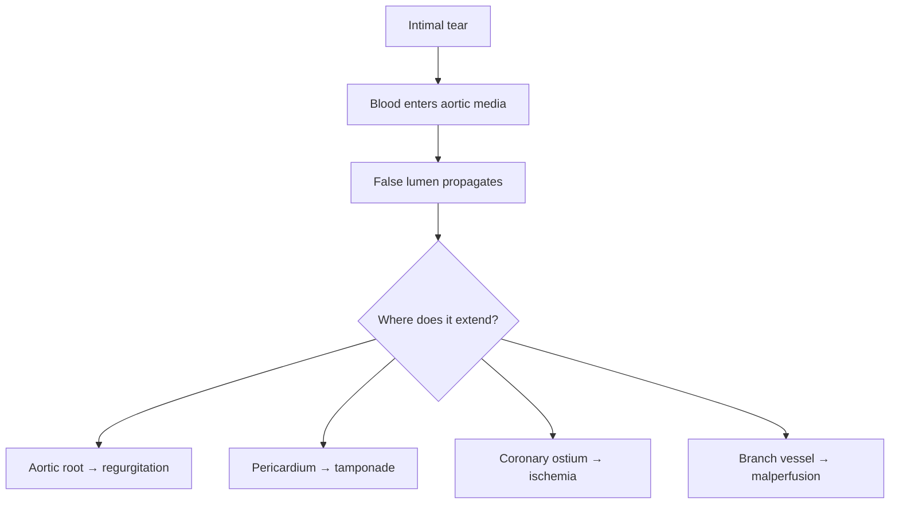
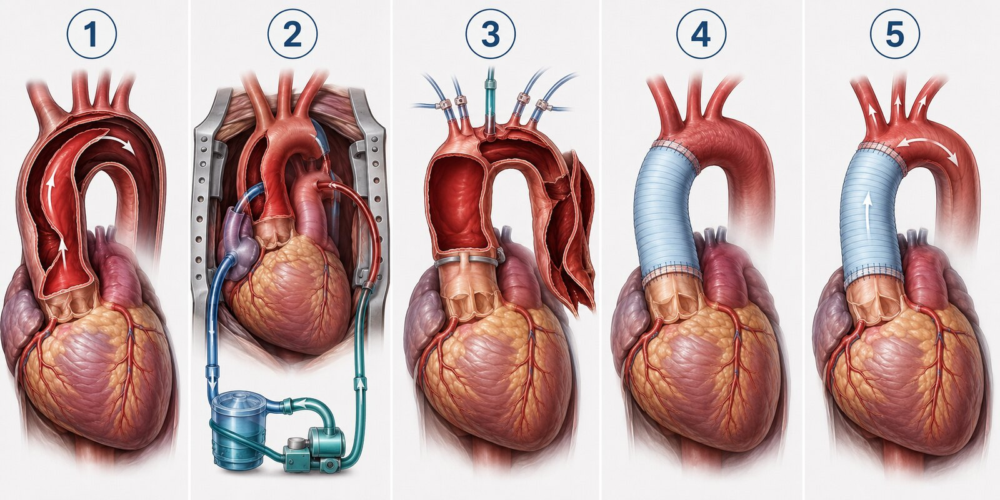
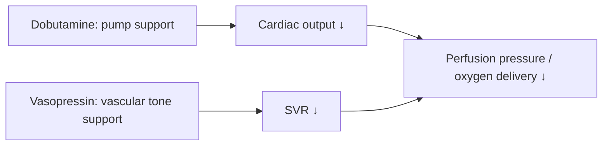
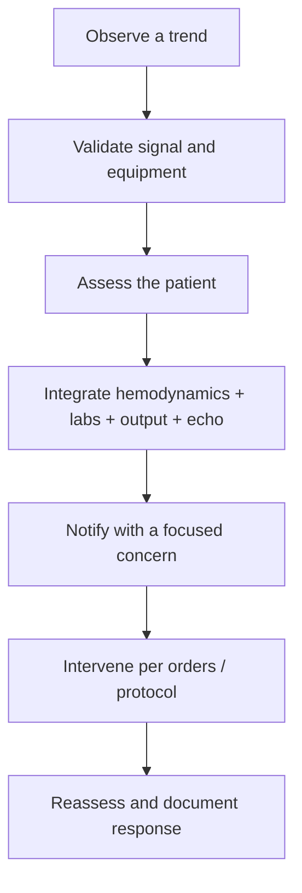

# From Aortic Emergency to CVICU Recovery

> **Bedside Teaching Series · Beginner CVICU RN**  
> An unfolding case review of acute Stanford Type A aortic dissection repair complicated by mixed postoperative low-cardiac-output physiology and vasoplegia.

  

> [!IMPORTANT]
> This is an **illustrative, de-identified teaching case**, not a real patient record or treatment protocol. Numeric targets, medication concentrations, titration increments, transfusion thresholds, and notification criteria must follow the surgeon's orders and local policy.

## Why this case matters

A patient can arrive from the operating room with **two different hemodynamic problems at the same time**:

- the heart is not generating enough forward flow; and
- the vascular system is too dilated to maintain pressure.

That combination explains why this patient needs **dobutamine** and **vasopressin**. The drugs are not interchangeable: one supports the pump; the other supports vascular tone.

## Learning objectives

By the end of this case, the learner should be able to:

1. Distinguish an ascending aortic aneurysm from a Stanford Type A dissection.
2. Trace how a dissection can produce tamponade, aortic regurgitation, coronary ischemia, and organ malperfusion.
3. Describe the goals and common components of emergency open repair.
4. Perform a structured postoperative assessment from airway through perfusion.
5. Explain why dobutamine and vasopressin may be used together.
6. Recognize bleeding, tamponade, neurologic injury, malperfusion, low cardiac output, and vasoplegia early.
7. Escalate a concerning trend without independently diagnosing or changing therapy.

---

## 1 · Meet the patient

**Mr. R** is a 62-year-old man with long-standing hypertension, hyperlipidemia, and tobacco exposure. He develops abrupt, severe chest pain radiating to his upper back, diaphoresis, nausea, and transient left-leg weakness. He has no previously documented aortic aneurysm.

### Emergency department snapshot

| Finding | Illustrative data | Why it matters |
|---|---:|---|
| Blood pressure | Right arm 188/92; left arm 164/84 mm Hg | A pulse/BP differential may reflect branch-vessel involvement, but its absence does not exclude dissection. |
| Heart rate | 104/min | Pain and sympathetic activation increase aortic wall stress. |
| Exam | New diastolic murmur; cool left foot | Consider acute aortic regurgitation and limb malperfusion. |
| Creatinine | 1.5 mg/dL from baseline 1.0 | May reflect impaired renal perfusion or chronic disease. |
| Lactate | 3.1 mmol/L | A trend marker of oxygen-delivery/perfusion imbalance; not a stand-alone diagnosis. |
| CTA | Intimal flap from aortic root through arch; true-lumen compression; moderate pericardial effusion | Ascending-aorta involvement makes this **Stanford Type A**. |
| Echocardiogram | Moderate-severe aortic regurgitation; no completed tamponade | Establishes valve/root and ventricular consequences. |

> [!NOTE]
> **Terminology:** “Stanford Type A” classifies a **dissection involving the ascending aorta**. “Aneurysm” means pathologic aortic dilation. They are different conditions, although a patient can have both. This case is specifically an **acute Type A aortic dissection**.

### First clinical priority

Acute Type A dissection is a surgical emergency. Before repair, the team reduces pain and aortic shear while avoiding hypotension that worsens organ perfusion. The bedside nurse anticipates rapid diagnostics, invasive access, blood availability, neurologic/peripheral vascular baselines, and transfer to an experienced aortic surgical team.



### The pathophysiology in plain language

The inner aortic layer tears. Pressurized blood tracks between wall layers and creates a **false lumen** beside the normal **true lumen**. The false lumen may compress the true lumen or interrupt flow into branch vessels. Because the ascending aorta sits beside the valve, coronary arteries, and pericardium, extension by only a short distance can become catastrophic.

> **Bedside translation:** Do not reduce this disease to “a bad aorta.” It can simultaneously become a valve problem, coronary problem, obstructive-shock problem, neurologic problem, and whole-body perfusion problem.

---

## 2 · How is an acute Type A dissection repaired?

The goal is not to “sew the flap shut.” The surgeon removes or excludes the life-threatening proximal entry tear, reconnects the aorta with a synthetic graft, restores dependable true-lumen flow, and repairs any damaged root or valve. The exact operation depends on where the tear extends and which structures are involved.



<sub>**Figure 1. Conceptual repair sequence.** This illustration teaches the major stages; cannulation site, cerebral-protection strategy, graft configuration, and extent of repair vary by anatomy and surgeon. It is not an operative blueprint.</sub>

### Stage 1 — Define the injury and plan the repair

After general anesthesia, the team uses transesophageal echocardiography to reassess the valve, aortic root, ventricular function, pericardial blood, and the visible dissection. The surgeon performs a **median sternotomy** to expose the heart and aorta.

The operative team determines:

- where the primary tear is;
- whether the aortic root, valve, or coronary ostia are involved;
- how far the arch is affected;
- whether organs or limbs are malperfused; and
- where arterial cannulation can deliver blood safely into the true lumen.

**What the nurse should remember:** the CTA shows the road map, but the operative findings determine the final repair.

### Stage 2 — Place the patient on cardiopulmonary bypass

The patient is fully anticoagulated. Venous cannulation drains deoxygenated blood from the right side of the heart to the heart-lung machine. The circuit oxygenates the blood and returns it through an arterial cannula. The arterial site may be the axillary artery, femoral artery, aortic arch/true lumen, or another site selected for the patient's anatomy and urgency.

Bypass temporarily performs the work of the heart and lungs. It allows the heart to be decompressed, the body to be cooled, and the aorta to be opened. Cardioplegia arrests and protects the myocardium; a ventricular vent may prevent distention.

> [!NOTE]
> Cannulation is not a minor setup detail in dissection. Returning bypass flow into the false lumen can worsen malperfusion, so the surgical and perfusion teams verify an effective true-lumen strategy.

### Stage 3 — Cool, protect the brain, and open the aorta

For an open arch or hemiarch anastomosis, the patient is cooled to reduce metabolic demand. Systemic circulation may be temporarily stopped—**hypothermic circulatory arrest**—so the surgeon can work in a bloodless distal aorta. Brain protection is commonly supplemented with selective antegrade cerebral perfusion; the precise temperature and cerebral-perfusion method follow the operative plan.

The surgeon opens the ascending aorta, identifies the intimal tear and true/false lumens, and removes the diseased ascending segment. If the tear or damaged tissue extends into the proximal arch, part of the arch is removed as a **hemiarch** repair.

**What this means postoperatively:** bypass time, cross-clamp time, circulatory-arrest time, cerebral-protection method, and lowest temperature help frame the risks of myocardial stunning, coagulopathy, vasoplegia, neurologic injury, and delayed rewarming.

### Stage 4 — Rebuild the aorta with a graft

A woven synthetic tube graft—commonly polyester—is sewn to stable distal aortic tissue. The distal connection is often completed first during circulatory arrest. The graft is de-aired, systemic perfusion is restarted through the graft or chosen cannulation site, and rewarming begins. The graft is then connected proximally near the sinotubular junction or to the selected root reconstruction.

In this case, the valve leaflets and root are salvageable, so the surgeon **resuspends the native aortic valve** and replaces the ascending aorta plus hemiarch.

| Root/valve finding | Possible surgical approach |
|---|---|
| Valve leaflets intact; root repairable | Valve resuspension with supracoronary ascending graft |
| Root extensively destroyed, aneurysmal, or coronary buttons involved | Composite root replacement, such as a Bentall-type operation |
| Suitable valve but root requires replacement | Valve-sparing root replacement in selected patients |
| Arch tear or major arch destruction | More extensive arch replacement, sometimes with a frozen elephant trunk strategy |

> [!IMPORTANT]
> A “Type A repair” is not one identical operation. At handoff, ask exactly what was replaced: ascending aorta, hemiarch or total arch, root, valve, coronary reimplantation, and any bypass grafts.

### Stage 5 — Restore circulation and test the repair

After de-airing and rewarming, the team removes the cross-clamp and allows the heart to resume beating. The patient is gradually separated from bypass while preload, rhythm, contractility, vascular tone, oxygenation, and acid-base status are optimized.

Transesophageal echocardiography evaluates:

- biventricular function;
- residual aortic regurgitation;
- graft/root appearance in the visible segments;
- regional wall-motion abnormalities that may suggest coronary compromise; and
- intracardiac air or other immediate problems.

Protamine reverses heparin. The team achieves surgical hemostasis, addresses coagulopathy, places mediastinal/pleural drains and temporary epicardial pacing wires as indicated, and closes the sternum and incision.

### What the CVICU nurse must get from the OR handoff

| Ask this | Because it changes bedside surveillance |
|---|---|
| What exactly was repaired or replaced? | Defines graft, valve, coronary, and arch risks. |
| Where were the arterial and venous cannulas? | Directs vascular and access-site assessment. |
| Bypass, cross-clamp, and circulatory-arrest times? | Helps anticipate stunning, inflammation, bleeding, and neurologic risk. |
| Lowest temperature and cerebral-protection method? | Frames rewarming and neurologic surveillance. |
| Pre- and post-bypass ventricular and valve findings? | Establishes the new baseline for hemodynamic interpretation. |
| Was separation from bypass difficult? Why? | Explains current inotropes, pressors, pacing, or mechanical support. |
| Blood products, coagulation concerns, and last drain output? | Establishes bleeding risk and trend. |
| Residual dissection or known malperfusion? | Targets renal, mesenteric, neurologic, and limb assessments. |

### Why separation from bypass can be difficult

| Operative stressor | Postoperative consequence |
|---|---|
| Myocardial ischemia/reperfusion, cardioplegia, long bypass time | Temporary ventricular stunning and low cardiac output |
| Inflammatory response to bypass | Vasodilation, capillary leak, and vasoplegia |
| Hypothermia and dilution | Coagulopathy and bleeding risk |
| Aortic/arch manipulation | Stroke or embolic risk |
| Preoperative branch-vessel compromise | Persistent renal, mesenteric, spinal, or limb malperfusion |
| Root/valve involvement | Residual aortic regurgitation or ventricular loading changes |

### Operating-room handoff

Mr. R arrives intubated and sedated. The repair is reported intact. Post-bypass echo shows no important residual aortic regurgitation, mildly reduced left-ventricular function, and moderately reduced right-ventricular function. Rhythm is sinus with epicardial wires available. The team reports difficult separation from bypass because of reduced forward flow plus low vascular tone.

**Illustrative admission data**

| Variable | On CVICU arrival | Interpretation question—not a conclusion |
|---|---:|---|
| MAP | 62 mm Hg | Is perfusion pressure adequate for this individual and repair? |
| Cardiac index | 1.8 L/min/m² | Does low flow fit the exam, echo, urine output, gases, and trend? |
| CVP | 14 mm Hg | Is this RV loading/failure, ventilator effect, tamponade, volume, or measurement artifact? |
| SVR | 720 dyn·s/cm⁵ | Does low vascular tone contribute to hypotension? |
| SvO₂ | 57% | Is oxygen delivery inadequate relative to consumption? |
| Lactate | 4.2 mmol/L | Is perfusion improving or worsening over serial measurements? |
| Urine output | 20 mL in first hour | Is renal perfusion falling, and what is the trend? |
| Chest-tube output | 90 mL in first hour | What is the rate, character, trajectory, and local trigger for escalation? |

These data suggest a **mixed phenotype**: impaired pump performance and vasodilation. No single number proves the diagnosis.



---

## 3 · Why both dobutamine and vasopressin?

### Dobutamine: help the pump

Dobutamine is primarily a beta-adrenergic inotrope. It can increase myocardial contractility and stroke volume, thereby improving cardiac output. It may also increase heart rate and myocardial oxygen demand and can lower vascular resistance in some patients.

**The nurse evaluates the response—not merely the blood pressure:**

- cardiac output/index and stroke-volume trend, when monitored;
- arterial waveform and pulse pressure;
- skin temperature, capillary refill, mentation, and urine output;
- SvO₂/ScvO₂, lactate, and acid-base trend in context;
- rhythm, ectopy, heart rate, and ischemic changes;
- right- and left-ventricular findings on echo; and
- whether hypotension worsens as flow improves but vasodilation persists.

### Vasopressin: tighten the vascular container

Vasopressin acts at vascular V1 receptors to increase vascular tone through a non-catecholamine pathway. It can support mean arterial pressure in vasodilatory shock and may reduce the catecholamine requirement. Excess vasoconstriction can compromise skin, digital, mesenteric, or other regional perfusion.

**The nurse watches:**

- MAP and arterial waveform trend;
- extremity temperature, color, capillary refill, and pulses;
- abdominal findings and lactate trajectory;
- urine output and renal trend;
- sodium and fluid balance when clinically relevant; and
- the prescribed perfusion target and weaning sequence.

### The key mental model

| Question | If the answer is “yes” | Bedside implication |
|---|---|---|
| Is forward flow inadequate? | Think **pump** | Dobutamine may support contractility, but determine *why* flow is low. |
| Is vascular tone inadequate? | Think **pipes** | Vasopressin may support SVR/MAP, but check whether perfusion improves. |
| Are both present? | Think **mixed physiology** | One agent alone may not correct both problems. Reassess after every change. |
| Is the cause mechanical? | Think **fixable obstruction/structural problem** | Drugs must not delay echo, surgical evaluation, or intervention. |

> [!WARNING]
> Never assume “low pressure = more pressor” or “low cardiac index = more inotrope.” First consider bleeding, tamponade, tension physiology, severe ventricular failure, dysrhythmia, graft/valve trouble, inadequate preload, excessive afterload, and measurement error. A mechanical problem requires a mechanical solution.

---

## 4 · The first postoperative hour: a beginner's sequence

### A — Airway and ventilation

Confirm tube position and ventilator connection; review oxygenation, ventilation, breath sounds, chest movement, gases, temperature, and the effect of positive pressure on venous return and RV loading. Sudden unilateral findings, high airway pressures, or worsening hypotension demand rapid escalation.

### B — Bleeding and drains

Verify every drain is connected, patent per local practice, and not kinked. Mark output and trend the **rate, character, and trajectory**. Review the operative report, anticoagulation reversal, coagulation data, temperature, and blood products. A sudden stop in drainage with rising filling pressures and falling pressure can be more dangerous than continued visible output.

### C — Circulation and perfusion

Level and zero pressure systems per policy. Validate the arterial waveform before treating the number. Review rhythm, pacing readiness, MAP, CVP/PA data when present, cardiac output, vasoactive infusions, pulses, temperature, capillary refill, urine output, lactate, venous saturation, and echo findings as one story.

### D — Disability / neurologic status

Know the preoperative baseline. When safe and ordered, lighten sedation for a focused exam: pupils, level of consciousness, speech/commands, facial symmetry, and movement/strength in all extremities. New focal change after arch surgery is an emergency.

### E — Everything else

Check temperature, glucose plan, renal function, electrolytes, acid-base status, skin, limb perfusion, pain/sedation, lines, graft-site context, family communication, and outstanding orders.

### Connect the monitors to the patient



> **Say it out loud:** “I am not treating a monitor. I am using the monitor to ask a better question about perfusion.”

---

## 5 · Unfolding case: what would you do next?

<details>
<summary><strong>Checkpoint 1 — MAP falls to 54 mm Hg</strong></summary>

The arterial waveform is dampened after repositioning. Before requesting a medication change, inspect the patient, compare cuff pressure if appropriate, check the transducer level, tubing, flush response, and line position per policy. Treating an artifact can harm the patient.

**Teaching point:** validate the signal first unless the patient is visibly crashing—in which case assessment and emergency response occur simultaneously.
</details>

<details>
<summary><strong>Checkpoint 2 — Cardiac index remains low; CVP rises; urine output falls</strong></summary>

Do not label this “needs fluid.” Rising CVP plus falling flow can occur with RV dysfunction, tamponade, high intrathoracic pressure, severe tricuspid regurgitation, or volume excess. Assess waveform quality, rhythm, ventilation, drainage, pulses, perfusion, and trends; escalate for targeted echo/hemodynamic evaluation.

**Teaching point:** filling pressure is pressure—not a direct measurement of circulating volume or fluid responsiveness.
</details>

<details>
<summary><strong>Checkpoint 3 — Chest-tube output suddenly stops; MAP and pulse pressure fall</strong></summary>

Check the entire drainage system for a visible kink or dependent obstruction according to policy, assess heart sounds and hemodynamic trends, and notify the surgical team immediately. Do not strip/milk tubes unless explicitly allowed by local policy. Prepare for urgent echo and possible return to the operating room.

**Teaching point:** tamponade after cardiac surgery may not present with the classic textbook triad, and positive-pressure ventilation can obscure expected findings.
</details>

<details>
<summary><strong>Checkpoint 4 — MAP improves, but the left foot becomes cooler with a weaker Doppler signal</strong></summary>

Escalate immediately. Compare both limbs, document color, temperature, capillary refill, motor/sensory findings and Doppler signals, and preserve serial assessments. Pressure recovery does not guarantee regional perfusion; dissection-related or vasoconstrictor-associated malperfusion remains possible.

**Teaching point:** always ask, “Is the whole patient perfused—or only the arterial pressure improved?”
</details>

<details>
<summary><strong>Checkpoint 5 — Frequent ventricular ectopy appears after dobutamine is increased</strong></summary>

Assess hemodynamic stability and symptoms, verify electrolytes and acid-base status, review ischemic changes, ensure pacing/defibrillation readiness, and notify according to acuity and orders. Do not independently stop a critical infusion unless an emergency protocol or authorized order directs it.

**Teaching point:** the desired effect is improved forward flow; tachyarrhythmia and excess myocardial oxygen demand can erase that benefit.
</details>

---

## 6 · Complication radar

| Threat | Early clues | Immediate nursing focus |
|---|---|---|
| Surgical bleeding / coagulopathy | Rising or persistent drain output, hemodynamic decline, falling hemoglobin, abnormal coagulation/viscoelastic data | Trend precisely, maintain access/products readiness, warm patient, escalate by protocol |
| Tamponade | Falling pressure/output, narrowing pulse pressure, rising/equalizing filling pressures, sudden drain cessation, escalating support | Check system and patient; urgent surgical/echo escalation |
| Low-cardiac-output syndrome | Low CI/venous saturation, cool skin, oliguria, rising lactate, altered mentation | Determine pump, preload, afterload, rhythm, oxygen-carrying capacity, or mechanical cause |
| Vasoplegia | Hypotension with low SVR and preserved/high flow—or mixed with low flow | Support tone per orders; assess actual organ perfusion and contributing factors |
| RV failure | Rising CVP, low output, hepatic/renal congestion, RV dilation/dysfunction | Optimize oxygenation/ventilation, rhythm, preload and pulmonary vascular conditions with team |
| Stroke | Delayed awakening, new focal deficit, seizure, pupil change | Activate urgent neurologic/surgical pathway; record last known baseline |
| Renal/mesenteric/limb malperfusion | Oliguria/AKI; abdominal pain/distention/acidosis; cool/pulseless or weak limb | Serial organ-specific assessment and immediate escalation |
| Graft/valve/coronary problem | New ischemia, ventricular dysfunction, murmur, refractory shock | Urgent echo/surgical evaluation; do not mask with escalating drugs alone |
| Dysrhythmia | Loss of atrial contribution, bradycardia, AF, ventricular ectopy | Assess perfusion, electrolytes, pacing wires, ischemia, and prescribed rhythm plan |
| Respiratory failure | Hypoxemia, rising pressures, pulmonary edema, atelectasis | Lung assessment, recruitment/ventilation plan, fluid/hemodynamic integration |

---

## 7 · How to give the update

### A concise SBAR example

> **Situation:** “Mr. R is four hours after ascending-aorta/hemiarch repair. Over 20 minutes, MAP fell from 70 to 58 and cardiac index from 2.2 to 1.7 despite the current dobutamine and vasopressin.”  
> **Background:** “Post-bypass echo showed moderate RV and mild LV dysfunction. Chest-tube output was steady, then fell to near zero this hour.”  
> **Assessment:** “The waveform is valid. CVP rose from 12 to 18, pulse pressure narrowed, urine output fell, and he is cooler. I am concerned about an obstructive/mechanical cause such as postoperative tamponade rather than isolated vasoplegia.”  
> **Recommendation:** “Please evaluate now. Do you want urgent bedside echo and preparation for possible surgical intervention?”

### Document the clinical reasoning trail

Chart objective findings, precise time/trend, focused assessment, who was notified and when, orders/interventions, and the patient's response. Avoid retrospective labels that were not established at the time.

---

## 8 · Recovery trajectory

In this illustrative case, focused echo shows no tamponade and stable repair, with persistent RV-predominant dysfunction. Bleeding remains controlled. Over the next day, perfusion improves: cardiac index and venous saturation rise, lactate clears, urine output recovers, extremities warm, and neurologic examination is intact. Vasoactive support is reduced in the sequence prescribed by the team while the nurse reassesses after each change.

Recovery priorities expand to ventilator liberation, pulmonary hygiene, pain control, delirium prevention, mobility, blood-pressure control, renal surveillance, nutrition, incision care, and family teaching. Long-term care includes surveillance imaging of the remaining aorta, strict blood-pressure management, risk-factor modification, medication adherence, and evaluation of relatives/genetic risk when indicated.

> [!TIP]
> A successful operation repairs today's lethal segment. It does not erase lifelong aortic disease.

---

## 9 · Knowledge check

<details>
<summary><strong>1. Why might dobutamine lower MAP even when cardiac output improves?</strong></summary>

Its beta-adrenergic effects may increase flow while peripheral vasodilation lowers SVR. MAP reflects both flow and resistance, so the bedside nurse must evaluate both.
</details>

<details>
<summary><strong>2. Why is vasopressin not a treatment for ventricular stunning?</strong></summary>

It increases vascular tone but does not directly correct impaired contractility. Excess afterload can make ventricular ejection harder, which is why response must be reassessed.
</details>

<details>
<summary><strong>3. Does a high CVP prove the patient is fluid overloaded?</strong></summary>

No. CVP is a pressure influenced by RV function, intrathoracic pressure, valves, tamponade, venous tone, and volume. Interpret the waveform and trend with the patient, echo, and other data.
</details>

<details>
<summary><strong>4. Name four time-critical causes of deterioration after repair.</strong></summary>

Examples include bleeding, tamponade, graft/valve/coronary complication, severe ventricular failure, dysrhythmia, stroke, and persistent organ malperfusion.
</details>

<details>
<summary><strong>5. What is the most important clue that support is working?</strong></summary>

Improving whole-patient perfusion—not one isolated number: neurologic status, skin, urine output, flow, venous saturation, lactate/acid-base trajectory, and organ function should tell a coherent story.
</details>

---

## 10 · One-minute bedside recap

```text
TYPE A = ascending aorta involved → emergency open repair

POST-OP QUESTION 1: Is the pump moving blood forward?
POST-OP QUESTION 2: Are the vessels providing enough tone?
POST-OP QUESTION 3: Is a mechanical problem blocking recovery?

DOBUTAMINE → supports contractility / forward flow
VASOPRESSIN → supports vascular tone / MAP

TREND: brain + heart + lungs + kidneys + gut + limbs + drains
VALIDATE → ASSESS → INTEGRATE → ESCALATE → REASSESS
```

## References and evidence notes

1. Isselbacher EM, et al. [2022 ACC/AHA Guideline for the Diagnosis and Management of Aortic Disease](https://www.ahajournals.org/doi/10.1161/CIR.0000000000001106). *Circulation*. 2022. Primary US guideline.
2. Czerny M, et al. [EACTS/STS Guidelines for Diagnosing and Treating Acute and Chronic Syndromes of the Aortic Organ](https://www.annalsthoracicsurgery.org/article/S0003-4975%2824%2900077-8/fulltext). *Annals of Thoracic Surgery*. 2024. Joint specialty guideline.
3. Wahba A, et al. [2024 EACTS/EACTAIC/EBCP Guidelines on Cardiopulmonary Bypass in Adult Cardiac Surgery](https://academic.oup.com/ejcts/article/67/2/ezae354/8011475). *European Journal of Cardio-Thoracic Surgery*. 2025 publication of the 2024 guideline.
4. Jeppsson A, et al. [2024 EACTS Guidelines on Perioperative Medication in Adult Cardiac Surgery](https://www.eacts.org/clinical-practice-guideline/2024-eacts-guidelines-on-perioperative-medication-in-adult-cardiac-surgery/). *European Journal of Cardio-Thoracic Surgery*. 2024/2025.
5. Flower L, et al. [Management of Acute Aortic Dissection in Critical Care](https://pmc.ncbi.nlm.nih.gov/articles/PMC10572474/). *Journal of the Intensive Care Society*. 2023. Peer-reviewed clinical review used for bedside context.

### Editorial notes for repository use

- Suggested repository path: `bedside-teaching-series/type-a-aortic-dissection/README.md`
- All patient details and values are fictional and deliberately illustrative.
- Replace escalation triggers, hemodynamic goals, and medication practices with institution-approved language before local clinical distribution.
- Recommended review cycle: annual, and whenever a major aortic-disease or cardiac-surgery guideline changes.

---

<sub>Bedside Teaching Series · Clinical education only · Not a substitute for patient-specific orders, institutional policy, or real-time evaluation by the cardiac surgery and critical care teams.</sub>
